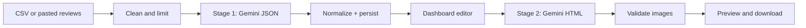

# Insights2Site

**Turn raw customer reviews into a conversion-ready website.**

Insights2Site is a two-stage AI pipeline that reads unstructured feedback, extracts the motivations behind it, and generates a complete one-page landing site. The intermediate draft is structured and editable, so you can inspect the reasoning, refine the copy, and only then render HTML.

[Quick Start](#quick-start) · [How It Works](#how-it-works) · [Architecture](#architecture) · [Documentation](#documentation)

---

## Why this approach

Most “reviews to website” tools send raw text into a single prompt and hope for a usable page. That collapses two different jobs into one call:

1. **Reasoning** — what customers want, what they complain about, and which claims are actually supported
2. **Rendering** — layout, visual hierarchy, imagery, and conversion structure

Insights2Site keeps those jobs separate.

| Stage | Job | Output | Why it is separate |
| --- | --- | --- | --- |
| **1. Intelligence** | Clean reviews, cluster pain / desire / keywords, write conversion copy | Typed JSON the dashboard can edit | Schema-first output is inspectable, cacheable, and safe to change |
| **Human checkpoint** | Edit headline, benefits, testimonials, tone, audience, and palette | Updated `GenerateResponse` | Prevents opaque one-shot generation |
| **2. Rendering** | Turn the approved draft into a full HTML page | Downloadable one-page site | Layout quality is not mixed with messy review analysis |

This is the same pattern used in production content systems: extract structure first, generate presentation second, keep a human in the loop.



---

## What you get

- **Review ingestion** — upload a CSV, pick the review column, or paste feedback
- **Structured insights** — pain points, desires, and keywords mapped to page sections
- **Conversion copy** — headline, subheadline, benefits, testimonials, CTA, and why-choose-us
- **Explainability** — generation reasons so each section can be traced back to review evidence
- **Design controls** — style, tone, audience, and three model-suggested color palettes
- **Full HTML export** — Tailwind-based one-page site with image URL validation
- **Local artifacts** — cleaned reviews, raw model output, normalized JSON, and HTML under `public/uploads` (gitignored)

---

## Quick start

**Requirements:** Node.js 20+ and a [Gemini API key](https://aistudio.google.com/apikey).

```bash
git clone https://github.com/wali332/insights2site.git
cd insights2site
npm install
cp .env.example .env.local
```

Add your key to `.env.local`:

```bash
GEMINI_API_KEY=your_api_key_here
# Optional. The API routes also fall back across several Gemini models.
GEMINI_MODEL=gemini-3-flash-preview
```

```bash
npm run dev
```

Open [http://localhost:3000](http://localhost:3000), then go to `/app` to start a generation run.

| Script | Purpose |
| --- | --- |
| `npm run dev` | Local development server |
| `npm run build` | Production build |
| `npm run start` | Serve the production build |
| `npm run lint` | ESLint |

---

## How it works

### 1. Ingest reviews

On `/app`, upload a CSV or paste review text. The client parses headers in the browser so you can choose the review column instead of assuming a schema. Selected rows are turned into a single review corpus and sent to Stage 1.

Cleaning rules on the server:

- drop empty and header-like lines
- require at least 20 characters per review
- cap the corpus at 60 reviews

### 2. Extract intelligence (Stage 1)

`POST /api/generate` asks Gemini to return **strict JSON only**:

- strengths, pain points, customer types, keywords
- headline, subheadline, features, testimonials, CTA, why-choose-us
- company name suggestion
- style / tone / audience defaults from a fixed allow-list
- three hex color palettes
- short reasons for each generated section

The route then normalizes that payload into the shared `GenerateResponse` type, applies safe fallbacks, and writes artifacts for debugging.

### 3. Edit the draft

`/app/dashboard` hydrates from `localStorage` and the last server draft. You can change copy, brand name, and design preferences before anything is rendered. This is intentional: the model proposes, the user approves.

### 4. Render the site (Stage 2)

`POST /api/generate-html` takes the edited JSON plus preferences and asks Gemini to return a complete HTML document. The server then:

- extracts HTML from the model response
- checks for a valid `html` / `body` document
- `HEAD`-checks image URLs and replaces broken ones
- writes the page under `public/uploads/html`

You can open the site in a new tab or download the HTML file.

---

## Architecture

```
app/
  page.tsx                 Marketing landing page
  app/page.tsx             Review upload and onboarding
  app/dashboard/page.tsx   Insight editor and site generator
  api/upload               Persist uploaded CSV
  api/generate             Stage 1: reviews → structured JSON
  api/save-response        Persist dashboard drafts
  api/generate-html        Stage 2: JSON → HTML
components/                Input, insights, landing, and UI primitives
hooks/useGenerate.ts       Client orchestration and cache
services/api.ts            Typed API client
types/index.ts             Shared contracts
docs/                      Architecture, pipeline, prompts, and API notes
```

**Model strategy.** Generation routes try a candidate list (`GEMINI_MODEL`, then newer Flash variants, then 1.5 Flash) so a single unavailable model does not fail the run. Quota errors surface as `429`; other generation failures as `502`.

**Persistence.**

| Layer | What is stored | Why |
| --- | --- | --- |
| Browser `localStorage` | Latest JSON draft and generated HTML | Resume the dashboard without re-running Stage 1 |
| `public/uploads/` | CSV, cleaned reviews, raw/normalized JSON, HTML | Reproducibility and demo debugging |

Generated files are local-only and ignored by git.

---

## Stack

| Layer | Choice |
| --- | --- |
| App | Next.js 16 App Router, React 19, TypeScript |
| Styling | Tailwind CSS 4 |
| AI | Google Gemini via `@google/genai` |
| Runtime | Node.js API routes |

---

## Documentation

Start with the docs index, then read in this order:

1. [Architecture](docs/architecture.md) — system shape and why two stages
2. [Data pipeline](docs/data-pipeline.md) — exact payloads at each hop
3. [Prompt design](docs/prompts.md) — Stage 1 vs Stage 2 prompt contracts
4. [API reference](docs/api-reference.md) — routes, status codes, failure modes
5. [Frontend workflow](docs/frontend-workflow.md) — upload → dashboard → export
6. [Problem-statement mapping](docs/problem-statement-mapping.md) — requirements to implementation
7. [Operations and security](docs/operations-security.md) — secrets, artifacts, and publish checklist

---

## Environment

| Variable | Required | Description |
| --- | --- | --- |
| `GEMINI_API_KEY` | Yes | Google AI Studio / Gemini key. `GOOGLE_API_KEY` is also accepted. |
| `GEMINI_MODEL` | No | Preferred model. Defaults to `gemini-3-flash-preview`, then falls back. |

Never commit `.env.local`. Only `.env.example` is tracked.

---

## Deploy

Deploy as a standard Next.js app (Vercel or any Node host). Set `GEMINI_API_KEY` in the host environment.

This project is built for hackathon and demo velocity: local filesystem artifacts, no auth, and no multi-tenant isolation. For production, add authentication, object storage instead of `public/uploads`, retention policy, and PII controls.

---

## License

MIT. See [LICENSE](LICENSE).
